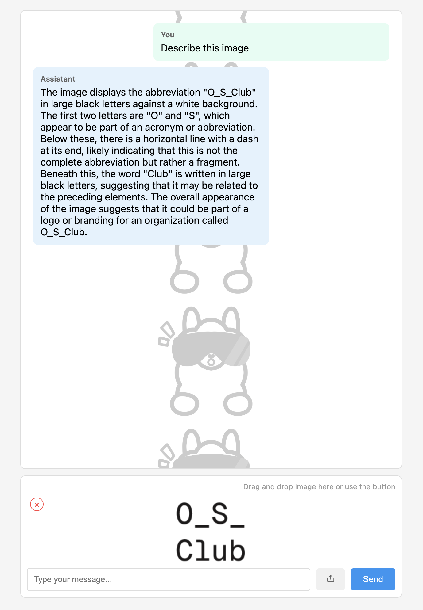

# Ollama-Llama-3.2-Vision-p5js-Chatbot

A web interface for interacting with Ollama's Llama 3.2 Vision model, built with p5.js. This application allows you to chat with an AI assistant and share images for visual analysis.

## Preview




## Prerequisites

1. Download and install from [Ollama.com](https://ollama.com)

2. Pull and run the Llama 3.2 Vision model:

   ```sh
   ollama run llama3.2-vision
   ```

## Setup

1. Clone this repository.
2. Ensure Ollama is running with the llama3.2-vision model.
3. Open index.html in your browser (using a local server).

## Usage

1. Type messages in the input field.
2. Upload images by clicking the upload button or drag-and-drop.
3. Press Enter or click Send to submit your message.
4. The AI will respond to both text and images.

## Note

Make sure the Ollama service is running on localhost:11434 before using the interface.

For more details about the Llama 3.2 Vision model and Ollama, visit [Ollama.com](https://ollama.com/blog/llama3.2-vision).
